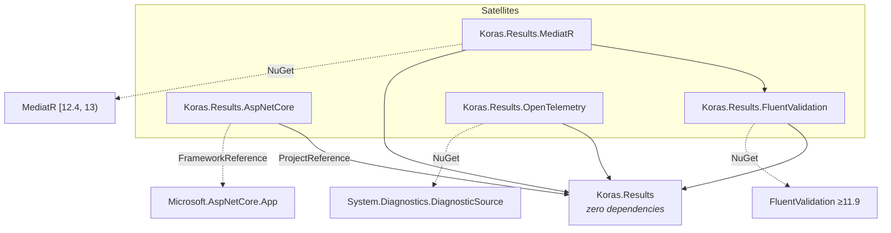
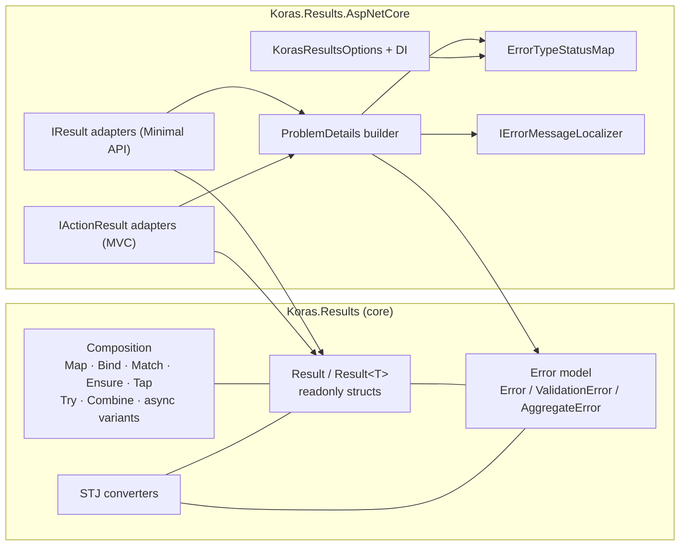
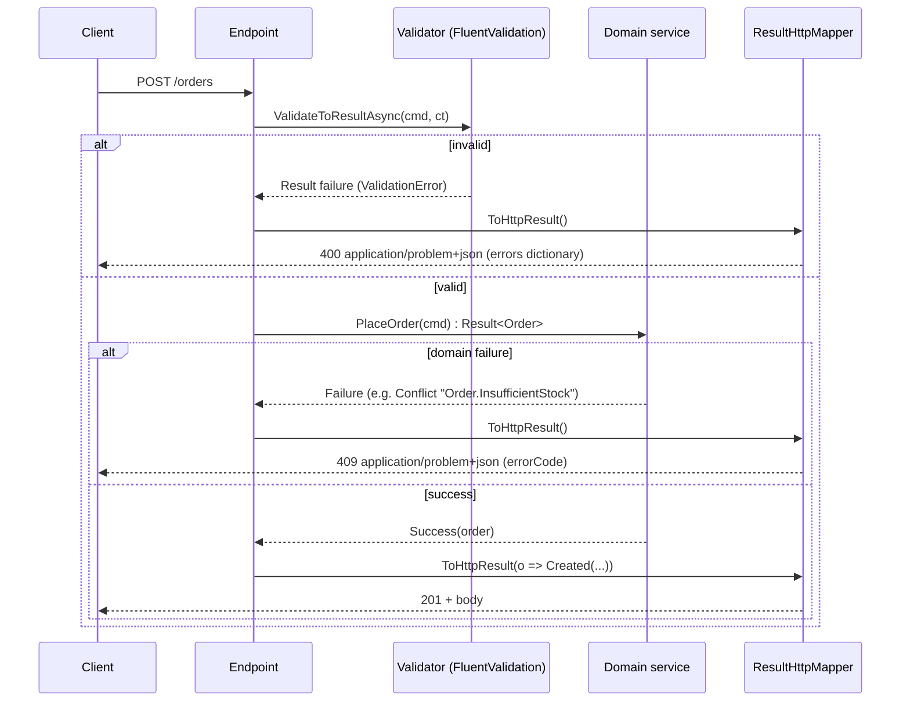
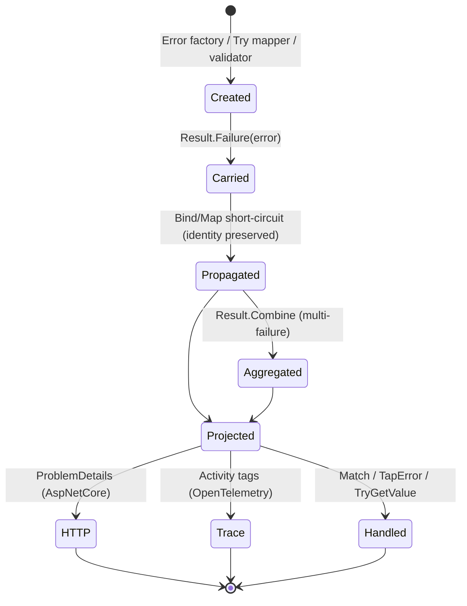
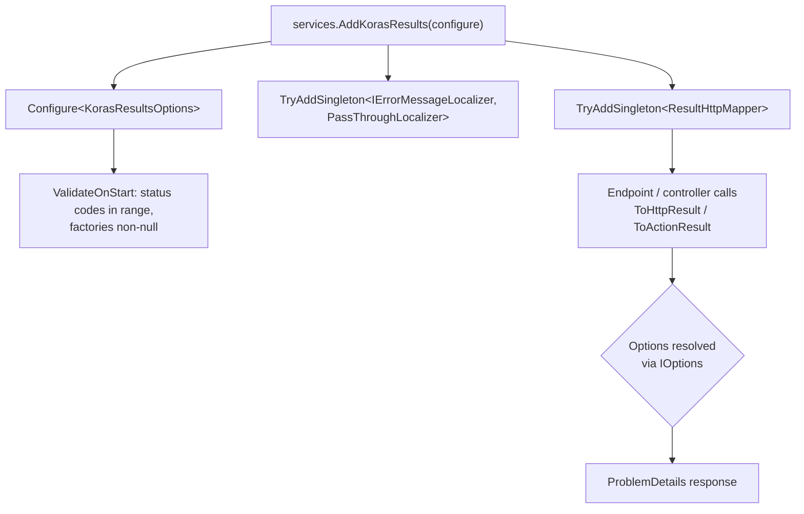
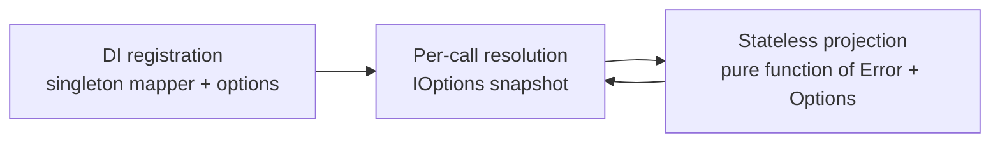

# Architecture Diagrams — Koras.Results

## 1. Package dependency diagram

## 2. Component architecture

## 3. Request lifecycle (Minimal API)

## 4. Error lifecycle

## 5. Dependency-injection flow (AspNetCore)

## 6. Provider lifecycle

Not applicable in the classic sense — Koras.Results has no I/O providers. The nearest analogue is the projection pipeline lifecycle:

All services are stateless singletons; there is no per-request state, no disposal, no warm-up.

## 7. Telemetry flow

See [observability.md](observability.md#telemetry-flow) for the telemetry flow diagram.
