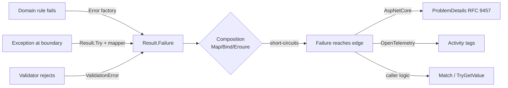

# Error Model — Koras.Results

## Principles

1. **Errors are values**, not exceptions. They are immutable, comparable, and serializable.
2. **Classification is semantic, not transport-shaped.** `ErrorType` describes what *kind of business/technical condition* occurred. HTTP status codes are a *projection* owned by the AspNetCore package.
3. **Codes are the machine contract.** `Error.Code` is a stable, dot-separated identifier (`"User.NotFound"`, `"Order.InsufficientStock"`). Messages are for humans and may be localized; codes never change meaning.
4. **Cancellation is not an error.** `OperationCanceledException` always propagates.

## The taxonomy (`ErrorType`)

| Value | Meaning | Typical origin | Default HTTP projection | Retryable? |
|---|---|---|---|---|
| `Failure` | A domain/business rule rejected the operation | Domain layer | 422 | no |
| `Validation` | Input is syntactically/semantically invalid | Application boundary | 400 | no (fix input) |
| `NotFound` | A referenced resource does not exist | Domain/repo | 404 | no |
| `Conflict` | State conflict (duplicate, concurrency, version) | Domain/infrastructure | 409 | sometimes |
| `Unauthorized` | Caller identity missing/invalid | Application | 401 | no (authenticate) |
| `Forbidden` | Caller identity known but not permitted | Application | 403 | no |
| `Unavailable` | A dependency is down/throttling/timing out | Infrastructure | 503 | yes |
| `Unexpected` | A bug or unclassified exception | Anywhere | 500 | unknown |

Why a **closed** enum (ADR-0004): a fixed taxonomy is what makes uniform dashboards, HTTP mapping, and cross-team contracts possible. Extensibility lives in `Code` (unbounded) and `Metadata`, not in inventing new categories. Eight categories cover the observed space; `Failure` is the catch-all for domain semantics, `Unexpected` for technical ones.

## Type hierarchy

```
Error                    (sealed-ish base: Code, Message, Type, Metadata)
├── ValidationError      (Type=Validation; + IReadOnlyList<FieldError>)
└── AggregateError       (Type=max-severity of children; + IReadOnlyList<Error>)
```

- `Error` construction goes through static factories (`Error.NotFound(code, message)` …) or the public constructor for custom scenarios.
- `FieldError` is a small record: `PropertyName`, `Message`, optional `Code`.
- `AggregateError` results from `Result.Combine` when heterogeneous errors aggregate. Its `Type` is chosen by severity precedence: `Unexpected > Unavailable > Forbidden > Unauthorized > Conflict > NotFound > Failure > Validation` (the projection must never under-report severity).
- Equality: `Error` equality is `Code + Type` value equality (metadata and message excluded) — errors are identities, messages are presentation.

## Error lifecycle



## Metadata rules

- `Metadata` is `IReadOnlyDictionary<string, object?>`; keys are camelCase.
- Values must be JSON-primitive-representable (string, number, bool, null, or arrays thereof) — enforced by serialization tests and documented.
- **Never** place secrets, credentials, connection strings, or PII in metadata or messages. The AspNetCore package exposes metadata to clients only when `KorasResultsOptions.MetadataExposure` allows it (default: none).

## HTTP projection (summary; details in AspNetCore docs)

- `ValidationError` → `HttpValidationProblemDetails`-shaped `errors` dictionary grouped by property name.
- Every ProblemDetails carries `extensions["errorCode"] = error.Code`.
- `Unexpected` errors: `detail` is replaced with generic text by default (`IncludeUnexpectedErrorDetails = false`) — internal messages must not leak.
- All mappings overridable per `ErrorType` and per exact `Code`.
