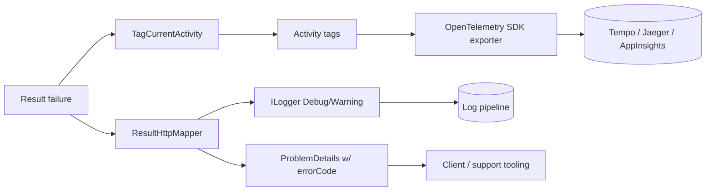

# Observability — Koras.Results

## Philosophy

A Result library must be observable **without being noisy**: it produces failure *data*; applications decide what becomes logs/metrics/traces. The core therefore emits nothing by itself. Satellites provide low-effort hooks.

## Tracing (Koras.Results.OpenTelemetry)

Tagging follows OpenTelemetry semantic conventions where they exist:

| Tag | Value | Convention |
|---|---|---|
| `otel.status_code` | `ERROR` (failures only) | standard |
| `error.type` | `ErrorType` lowercase (`not_found`, `validation`, …) | OTel `error.type` |
| `koras.error.code` | `Error.Code` (e.g. `User.NotFound`) | custom, stable |
| `koras.error.aggregate_count` | child count for `AggregateError` | custom |

API:
```csharp
result.TagCurrentActivity();          // ambient Activity.Current, no-op if none
result.TagActivity(activity);         // explicit
await pipeline.TapActivityErrorAsync(); // combinator form inside chains
```

Design rules: no-ops must be allocation-free when `Activity.Current` is null or not recording; success results never modify the activity (no tag spam); the package never creates activities — it only annotates the caller's.

## Logging (Koras.Results.AspNetCore)

| Level | Event | Category |
|---|---|---|
| Debug | Error mapped to status code (code, type, status) | `Koras.Results.AspNetCore.ResultHttpMapper` |
| Warning | `Unexpected` error detail suppressed from response (code logged, message logged, response sanitized) | same |

The core package **never logs** — it has no logger and never will (zero-dependency promise). Application-level logging belongs in `Tap`/`TapError`:

```csharp
result.TapError(e => logger.LogWarning("Order rejected: {ErrorCode}", e.Code));
```

Log-safety rule: log `Code` and `Type` freely; treat `Message`/`Metadata` as potentially sensitive at Information level and above (see security docs).

## Metrics

The package ships no meters in MVP (a meter forced on every consumer is noise). The documented recipe derives metrics from traces/logs, or applications add their own counter in a `TapError`. A first-party `Meter` (`koras.results.failures` counter tagged by `error.type`/`error.code`) is a 1.1 candidate — recorded in the roadmap, gated on user demand.

## Telemetry flow



## Correlation guidance (docs recipe)

ProblemDetails responses should carry the trace identifier; the AspNetCore package sets `extensions["traceId"]` from `Activity.Current?.Id ?? HttpContext.TraceIdentifier`, matching ASP.NET Core's own ProblemDetails behavior, so support staff can join a client-reported error to a trace.
