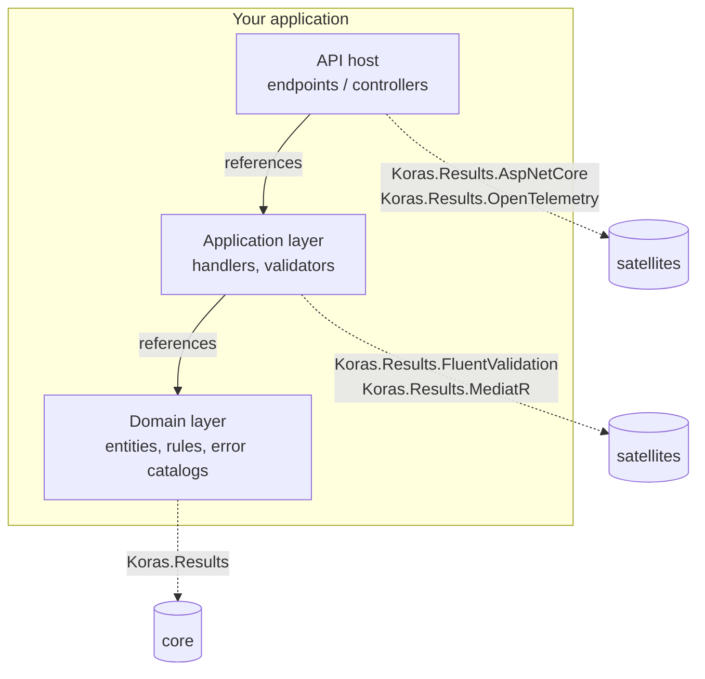

# Architecture

A user-facing view of how the Koras.Results packages fit together. For the full architectural documentation — decision records, dependency rules, package boundaries, observability model — see [`docs/architecture/`](../architecture/overview.md).

## One core, four satellites

Koras.Results is **one zero-dependency core package plus four opt-in integration packages** — not a monolith, and not a metapackage:

```
Koras.Results                      (core: zero dependencies)
├── Koras.Results.AspNetCore       (+ ASP.NET Core shared framework)
├── Koras.Results.FluentValidation (+ FluentValidation)
├── Koras.Results.MediatR          (+ MediatR 12.x; also refs Koras.Results.FluentValidation)
└── Koras.Results.OpenTelemetry    (+ System.Diagnostics.DiagnosticSource)
```

Why this shape (ADR-0001):

- The core must be safe to reference from a **domain layer**, which mandates zero dependencies — you can audit its dependency graph in ten seconds, because there is none.
- Each integration drags its own dependency axis (a web framework, a validation library, a mediator, a diagnostics API). Bundling any of them into the core would tax every consumer with dependencies they do not use.
- Satellites depend on the core; the core never depends on a satellite.

## Dependency direction in *your* application

The package topology mirrors the layering the library encourages:



- **Domain projects** reference only `Koras.Results`. They produce `Result<T>` and `Error` values classified by business meaning — never HTTP status codes.
- **Application projects** add the FluentValidation and/or MediatR satellites if they use those libraries.
- **Host projects** add `Koras.Results.AspNetCore` (and optionally OpenTelemetry) to project results into responses and telemetry.

HTTP mapping lives *exclusively* in the AspNetCore package (ADR-0004): the core never references HTTP, so an `Error` created in the domain carries no transport assumptions, and the same domain assembly serves web APIs, gRPC services, and background workers unchanged.

## What lives where

| Layer | Types | Package |
|---|---|---|
| Primitives | `Result`, `Result<T>` (readonly structs) | Core |
| Error model | `Error`, `ValidationError`, `FieldError`, `AggregateError`, `ErrorType` | Core |
| Composition | `Map`/`Bind`/`Match`/`Ensure`/`Tap`/`MapError`, async variants, `Result.Try*`, `Result.Combine` | Core |
| Serialization | System.Text.Json converters (attribute-wired) | Core |
| HTTP projection | `ToProblemDetails`, `ToHttpResult`, `ToActionResult`, `KorasResultsOptions`, `IErrorMessageLocalizer` | AspNetCore |
| Validation adapters | `ToResult`, `ToValidationError`, `ValidateToResult(Async)` | FluentValidation |
| Pipeline behavior | `ValidationBehavior<,>` | MediatR |
| Telemetry | `TagCurrentActivity`, `TapActivityErrorAsync`, activity tag constants | OpenTelemetry |

## Design decisions you will feel as a user

| Decision | Consequence for you | ADR |
|---|---|---|
| Core + satellites | Install only what you use; domain stays dependency-free | 0001 |
| `net8.0;net9.0;net10.0`, no `netstandard2.0` | Modern runtimes only | 0002 |
| `readonly struct` results; `default` = failure | Allocation-free happy path; an uninitialized result is never a fake success | 0003 |
| Closed 8-value `ErrorType` taxonomy | Uniform dashboards and HTTP mapping; extend via `Code` + `Metadata`, not new categories | 0004 |
| Immutable `Error` class with static factories | Errors are shareable values; `ValidationError`/`AggregateError` are the only subclasses | 0005 |
| MediatR pinned to 12.x | Apache-2.0 licensed line, not the commercial 13+ | 0006 |
| System.Text.Json only | Converters attribute-wired; serialization works with zero setup | 0007 |
| PublicApiAnalyzers lock the API surface | No breaking changes within a major version | 0008 |

## Cross-cutting guarantees

- **Immutability everywhere:** every public type is immutable and safe to share across threads ([thread safety](thread-safety.md)).
- **Cancellation is not failure:** `OperationCanceledException` always propagates ([cancellation](cancellation.md)).
- **The core never** references ASP.NET Core, performs I/O, logs, reads configuration, mutates statics, or throws for control flow.
- **Async-first:** all library async code uses `ConfigureAwait(false)`; there is no sync-over-async.

## Deep-dive references

- [Architecture overview](../architecture/overview.md) — the full layered view
- [Error model](../architecture/error-model.md) — taxonomy rationale and lifecycle
- [Decision records](../architecture/decision-records/) — every ADR with context and trade-offs
