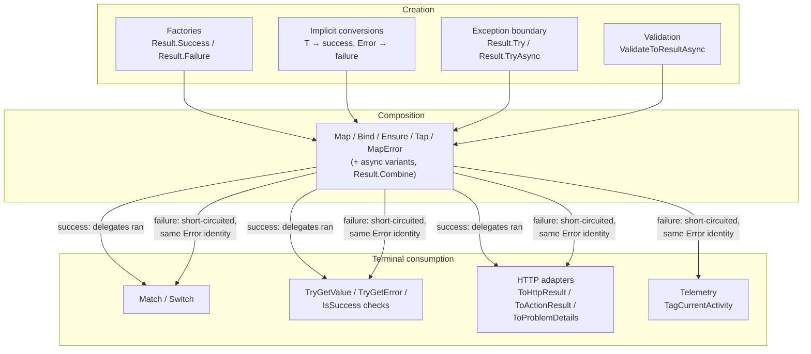

# Result Lifecycle

Every result moves through three phases: **creation** (something succeeds or fails), **composition** (the outcome flows through a pipeline), and **terminal consumption** (the outcome becomes a response, a log line, a retry decision). Understanding the guarantees at each phase is most of what there is to know about using the library well.



## Phase 1 — Creation

A result is born in one of four ways:

```csharp
// 1. Explicit factories
Result ok        = Result.Success();
Result<User> u   = Result.Success(user);
Result<User> nf  = Result.Failure<User>(UserErrors.NotFound(id));

// 2. Implicit conversions (the idiomatic form inside domain code)
Result<User> a = user;                    // T -> success
Result<User> b = UserErrors.NotFound(id); // Error -> failure

// 3. Exception boundary — wrap exception-throwing code at the edge
Result<Config> cfg = Result.Try(
    () => JsonSerializer.Deserialize<Config>(json)!,
    ex => ConfigErrors.Malformed());

Result<byte[]> data = await Result.TryAsync(
    () => File.ReadAllBytesAsync(path),
    ex => FileErrors.Unreadable(path));

// 4. Validation adapters (Koras.Results.FluentValidation)
Result<CreateTodo> valid = await validator.ValidateToResultAsync(command, ct);
```

Notes on `Try`/`TryAsync`:

- Without a `mapError`, the failure is `Error.Unexpected("Unexpected.Exception", "An unexpected error occurred.")` with `metadata["exceptionType"]` set to the exception's full type name. The exception *message* is deliberately excluded — the default must be safe to project to clients.
- `OperationCanceledException` is **always rethrown**, never converted — see [cancellation](cancellation.md).

## Phase 2 — Composition

Combinators let you chain steps without checking `IsFailure` after each one. The rules are strict and uniform:

- **Short-circuit:** once a failure exists, success-path delegates (`Map`, `Bind`, `Ensure`, `Tap`) are **never invoked**. Symmetrically, failure-path delegates (`MapError`, `TapError`) are never invoked on success.
- **Error identity preserved:** a short-circuiting failure passes through as the *same* `Error` instance — no wrapping, no copying, no information loss.
- **No hidden catching:** exceptions thrown by your delegates propagate; combinators are pure plumbing, not `try/catch` blocks. Only `Result.Try*` converts exceptions.

```csharp
public Result<Order> Place(PlaceOrder cmd) =>
    _catalog.Find(cmd.Sku)                          // Result<Product> — may fail NotFound
        .Ensure(p => p.Stock >= cmd.Qty,            // post-condition: fail if predicate false
                p => OrderErrors.InsufficientStock(p.Sku))
        .Map(p => Order.Create(p, cmd.Qty))         // transform value (cannot fail)
        .Tap(o => _logger.LogInformation("Order {Id} placed", o.Id))  // side effect, pass-through
        .MapError(e => e.WithMetadata("sku", cmd.Sku));               // enrich failures
```

If `Find` fails, neither the `Ensure` predicate, the `Map` projection, nor the `Tap` action run — the `NotFound` error simply arrives at `MapError` and then at the caller.

The pick-list:

| Combinator | Use when |
|---|---|
| `Map` | Transforming a success value with a function that cannot fail |
| `Bind` | Chaining the next operation that itself returns a `Result` |
| `Ensure` | Asserting a post-condition on the value, failing with your error |
| `Tap` / `TapError` | Side effects (logging, metrics) without altering the outcome |
| `MapError` | Translating or enriching errors, typically at layer boundaries |
| `Result.Combine` | Merging independent results (2+ failures aggregate; see [core abstractions](core-abstractions.md#aggregateerror)) |

Every combinator has async variants (`MapAsync`, `BindAsync`, `EnsureAsync`, `TapAsync`, `TapErrorAsync`, `MatchAsync`) accepting `Task<Result<T>>` receivers and/or `Task`-returning delegates, so a whole pipeline can be awaited once at the end:

```csharp
Result<ReceiptDto> receipt = await LoadOrderAsync(id)        // Task<Result<Order>>
    .EnsureAsync(o => !o.Shipped, OrderErrors.AlreadyShipped(id))
    .BindAsync(o => _payments.ChargeAsync(o, ct))            // Task<Result<Payment>>
    .MapAsync(p => ReceiptDto.From(p));
```

## Phase 3 — Terminal consumption

Eventually one piece of code must collapse the two-track outcome into a single effect. There are three families:

```csharp
// Exhaustive fold — both branches must be handled, compiler-enforced
string label = result.Match(
    onSuccess: order => $"Order {order.Id}",
    onFailure: error => $"Failed: {error.Code}");

result.Switch(                      // same, for side effects
    onSuccess: order => Publish(order),
    onFailure: error => _logger.LogWarning("Rejected: {Code}", error.Code));

// Imperative inspection — first-class, not a second-class citizen
if (result.TryGetValue(out var order)) { /* ... */ }
if (result.IsFailure && result.Error.Type == ErrorType.Unavailable) { /* schedule retry */ }

// Edge adapters — one call ends the pipeline (Koras.Results.AspNetCore)
app.MapGet("/orders/{id:guid}", (Guid id, IOrderService svc) =>
    svc.Get(id).ToHttpResult());    // 200/204/problem+json, status from ErrorType
```

Terminal consumption is also where cross-cutting projections attach — `TagCurrentActivity()` (OpenTelemetry package) records `error.type` and `koras.error.code` on the current span for failures, as a chainable pass-through.

A result that is never consumed is a bug in your logic, not in the library — nothing observes outcomes for you. Endpoint code should always end in an adapter or a `Match`.

## Further reading

- [Core abstractions](core-abstractions.md) — the types being composed
- [Cancellation](cancellation.md) — why no combinator takes a `CancellationToken`
- [Error handling](error-handling.md) — what to do at layer boundaries with `MapError`
